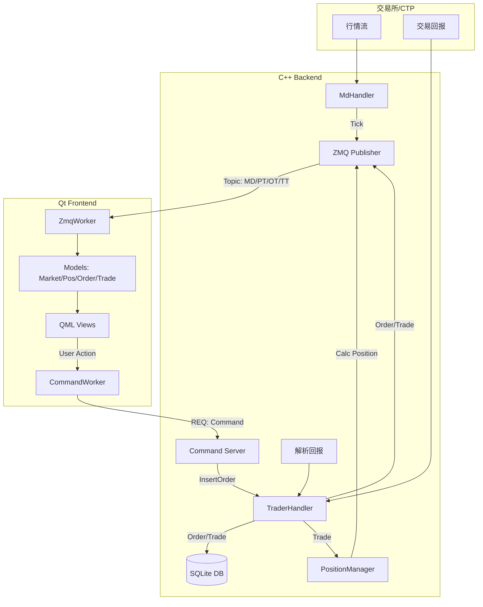

# A-Trader 系统数据链路架构文档

本文档详细说明了 A-Trader 系统中，从 CTP Core 后端启动到 Qt Manager 前端使用过程中，各类关键数据的加载、变化及流转过程。

## 1. 核心架构概览

系统采用 **CTP Core (C++)** 作为交易与数据中心，**Qt Manager (Qt/QML)** 作为用户交互终端。两者通过 **ZMQ (ZeroMQ)** 进行跨进程通信。

*   **CTP Core**: 负责连接交易所、行情订阅、报单路由、持仓计算、数据持久化 (SQLite)。
*   **Qt Manager**: 负责数据展示、用户指令发送、本地状态管理。

### 通信机制 (ZMQ)
*   **PUB/SUB (发布/订阅)**: Core -> Qt (单向推送)。
    *   Topics: `MD` (行情), `MB` (二进制行情), `PT` (持仓), `AT` (资金), `IT` (合约), `OT` (报单), `TT` (成交), `ST` (策略/条件单)。
*   **REQ/REP (请求/应答)**: Qt -> Core (同步/异步指令)。
    *   Commands: 下单, 撤单, 订阅行情, 查询状态等。

---

## 2. Core 启动与数据初始化流程

Core 启动时的数据加载决定了系统的初始状态。

### 2.1 启动阶段 (main.cpp)
1.  **配置加载**: 读取 `config.json`，获取 CTP 账号、ZMQ 端口、数据库路径。
2.  **Publisher 初始化**: 绑定 ZMQ PUB 端口 (默认 5555)。
3.  **DBManager 初始化**: 连接 SQLite 数据库，创建/检查表结构。
4.  **订阅列表加载**: 从 DB `subscriptions` 表加载上次订阅的合约列表。
5.  **Handler 初始化**:
    *   `MdHandler`: 传入订阅列表，准备连接行情前置。
    *   `TraderHandler`: 传入账户信息，准备连接交易前置。
    *   `ConditionEngine`: 初始化条件单引擎，从 DB 恢复未触发的条件单。

### 2.2 交易登录与数据恢复 (TraderHandler::OnRspUserLogin)
1.  **登录成功**: 记录 `TradingDay` (交易日)、`FrontID`、`SessionID`。
2.  **合约加载 (Load Instruments)**:
    *   检查 DB 中是否已有当日的合约信息 (`instrument_cache_`)。
    *   **如果有效**: 直接从 DB 加载到内存，避免全量查询 CTP (耗时)。
    *   **如果无效/无数据**: 触发 `reqQryInstrument` 查询全市场合约，并保存到 DB。
    *   **关键数据**: 合约乘数 (`VolumeMultiple`)、最小变动价位 (`PriceTick`)，这对盈亏计算至关重要。
3.  **报单与成交恢复**:
    *   从 DB `orders` 和 `trades` 表加载 **当日** 的记录。
    *   通过 Publisher 推送给前端 (Topic: `OT`, `TT`)，确保前端重启后通过 `SYNC_STATE` 能看到当日历史记录。
4.  **持仓初始化**:
    *   Core 内部维护 `PositionManager`。
    *   启动时通过 `reqQryInvestorPositionDetail` (查询持仓明细) 初始化 `PositionManager`。
    *   后续的持仓变化完全依赖 `OnRtnTrade` (成交回报) 进行内存计算 (Local Calculation)。

---

## 3. 关键数据链路详解

### 3.1 行情数据 (Market Data)
**链路**: `CTP` -> `MdHandler` -> `Publisher` -> `ZmqWorker` -> `MarketModel` / `PositionModel` / `OrderController`

1.  **源头**: `MdHandler::OnRtnDepthMarketData` 收到 CTP 行情。
2.  **处理**:
    *   转换为标准 `TickData` 结构。
    *   计算/填充扩展字段 (如涨跌停板，如果在 CTP 数据中缺失)。
3.  **推送**:
    *   **二进制模式 (`MB`)**: 高频推送，直接发送 `TickData` 结构体，极低延迟。
    *   **JSON 模式 (`MD`)**: 用于低频更新或调试。
4.  **Qt 端消费**:
    *   `ZmqWorker`: 解析数据。
    *   `MarketModel`: 更新行情列表 UI (最新价、涨跌幅、颜色变化)。
    *   `PositionModel`: **关键**，利用最新价 (`LastPrice`) 计算持仓浮动盈亏。
    *   `OrderController`: 更新下单面板的默认价格 (如对手价)，检查价格笼子。

### 3.2 报单与成交 (Order & Trade)
**下单链路**: `Qt UI` -> `OrderController` -> `CommandWorker` -> `CommandServer` -> `TraderHandler` -> `CTP`

1.  **用户下单**: Qt 点击下单，组装 JSON 指令 (`CMD_ORDER`)。
2.  **指令传输**: 通过 ZMQ REQ 发送给 Core。
3.  **Core 执行**: `TraderHandler::insertOrder` 调用 CTP `ReqOrderInsert`。
4.  **回报链路 (Rtn)**:
    *   **报单状态 (`OnRtnOrder`)**:
        *   状态变化: `Unknown` -> `NoTradeQueueing` (排队中) -> `AllTraded` (全部成交) / `Canceled` (已撤单)。
        *   **数据落库**: 存入 DB `orders` 表。
        *   **推送**: Topic `OT` -> Qt `OrderModel` (更新列表中状态)。
    *   **成交回报 (`OnRtnTrade`)**:
        *   **数据落库**: 存入 DB `trades` 表。
        *   **持仓更新**: **关键**，调用 `PositionManager::UpdateFromTrade`，根据开平标志 (`Open`/`Close`) 实时增减持仓、计算释放/占用保证金、计算平仓盈亏。
        *   **推送**: Topic `TT` -> Qt `TradeModel` (添加成交记录)。

### 3.3 持仓数据 (Position)
**链路**: `CTP Trade` -> `PositionManager` (Core) -> `Publisher` -> `Qt PositionModel`

A-Trader 采用 **本地实时计算** 策略，而非轮询查询 CTP 持仓。

1.  **变化源**: 仅在 `OnRtnTrade` (成交) 时触发变化。
2.  **核心计算 (`PositionManager`)**:
    *   **开仓**: 增加 `Position`, `TodayPosition/YdPosition`, 更新 `OpenCost` (开仓成本), `PositionCost` (持仓成本)。
    *   **平仓**: 减少持仓，计算 **平仓盈亏 (`CloseProfit`)**。支持先开先平 (FIFO) 或其他规则。
    *   **数据结构**: 聚合为 `PositionData` (扁平化结构，区分多/空方向)。
3.  **Snapshot 推送**:
    *   每次成交后，Core 生成全量持仓快照。
    *   Topic `PT` -> Qt `PositionModel`。
4.  **Qt 端处理**:
    *   `PositionModel` 接收快照，更新 UI 的数量、成本。
    *   **动态计算**: 前端收到新行情 (`TickData`) 时，结合持仓数量和最新价，实时计算 **浮动盈亏 (`PositionProfit`)**。
    *   `AccountInfo`: 汇总所有持仓的浮动盈亏，计算动态权益 (`Equity = Balance + FloatingProfit`)。

### 3.4 合约属性 (Instrument)
**链路**: `DB` / `CTP Query` -> `InstrumentMeta` -> `Qt`

1.  **重要性**: 包含 `PriceTick` (最小变动价位) 和 `VolumeMultiple` (合约乘数)。
    *   没有乘数，无法计算盈亏 (盈亏 = 价差 * 数量 * **乘数**)。
2.  **同步机制**:
    *   Qt 启动时发送 `SYNC_STATE` 指令。
    *   Core 将内存缓存的所有 `InstrumentMeta` 推送给 Qt (Topic `IT`)。
    *   Qt `MarketModel` 和 `PositionModel` 内部维护一个 `QHash<InstrumentID, Meta>` 字典，用于后续计算。

---

## 4. 异常处理与状态同步

### 4.1 断线重连
*   **ZmqWorker 心跳**: Qt 每 5 秒检测一次 CTP 数据流。如果超时，显示连接断开图标。
*   **Core 重连**: CTP API 自带断线重连。重连成功后 (`OnFrontConnected`)，Core 会自动重新登录并重新订阅行情。

### 4.2 UI 重启 (Qt Restart)
*   **Sync State**: Qt 启动连接 ZMQ 成功后，立即发送 `SYNC_STATE`。
*   **Core 响应**:
    1.  推送所有缓存的合约属性。
    2.  推送缓存的账户资金。
    3.  推送缓存的持仓快照。
    4.  推送当日所有的报单和成交历史。
*   **结果**: 用户感觉不到 UI 重启过，数据完美恢复。

## 5. 总结：数据流向图

